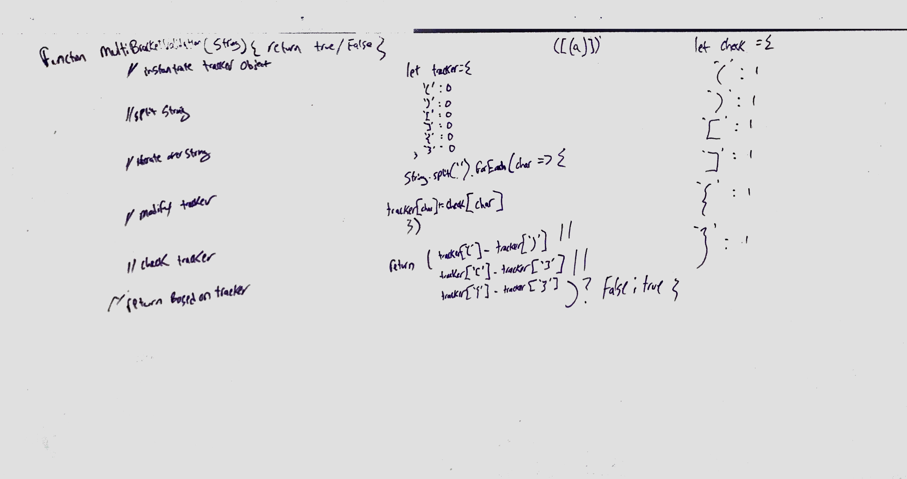

# Challenge Summary
Do some multi bracket validation

## Challenge Description

Your function should take a string as its only argument, and should return a boolean representing whether or not the brackets in the string are balanced. There are 3 types of brackets:
  * Round Brackets : ()
  * Square Brackets : []
  * Curly Brackets : {}

## Approach & Efficiency

make an object to access and check for then modify a second object in order to track these things

 