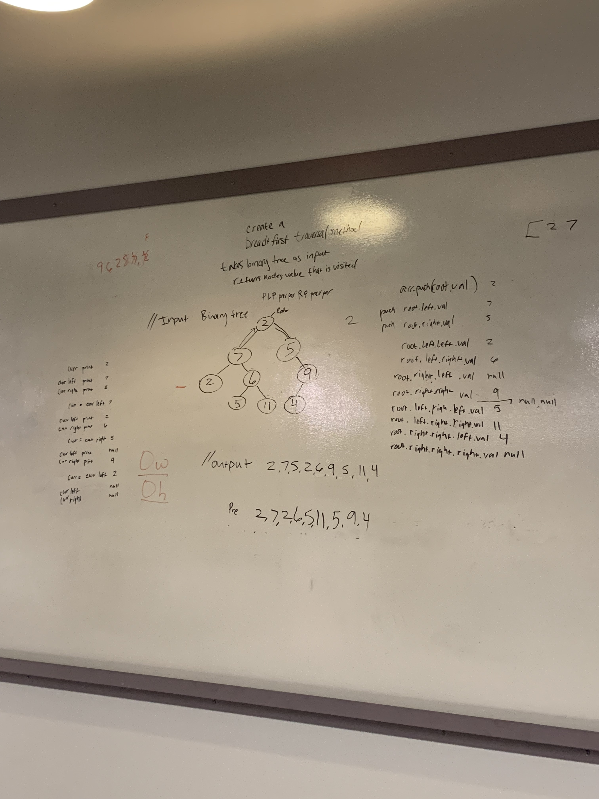

# Challenge Summary
Implement Breadth first traversal of a tree

## Challenge Description

Write a breadth first traversal method which takes a Binary Tree as its unique input. Without utilizing any of the built-in methods available to your language, traverse the input tree using a Breadth-first approach; print every visited node’s value.

## Approach & Efficiency
We utilized a queue so that values could be ordered correctly, seen only once and reduce space complexity. Further the description of the challenge said to extend the tree class so that has been done here in the same file.

## Solution

