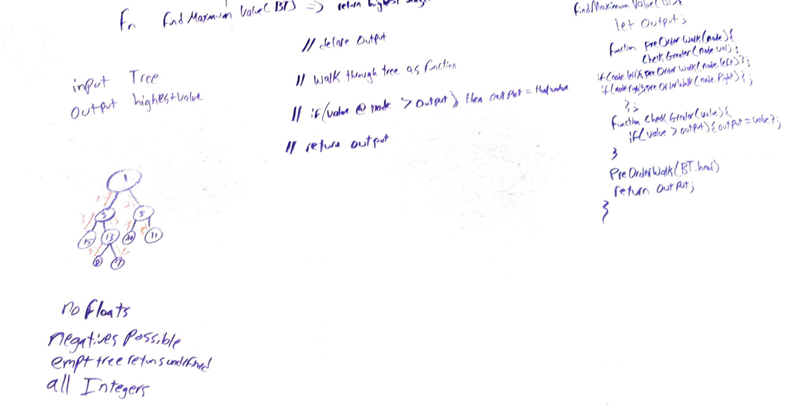

# Challenge Summary
Find the Maximum Value in a Binary Tree

## Challenge Description

Write a function called find-maximum-value which takes binary tree as its only input. Without utilizing any of the built-in methods available to your language, return the maximum value stored in the tree. You can assume that the values stored in the Binary Tree will be numeric.

## Approach & Efficiency
We utilized a preOrder Tree traversal to ensure that every single value was hit and we did not take up any additional space. 

## Solution

